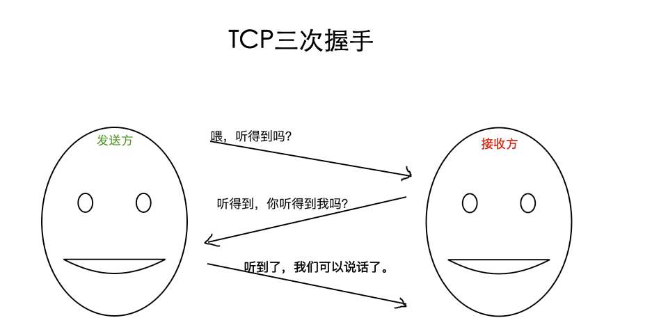
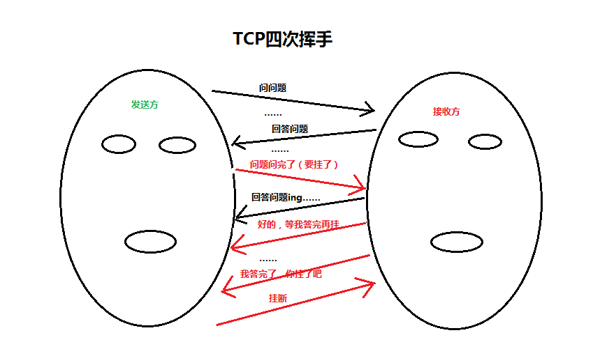
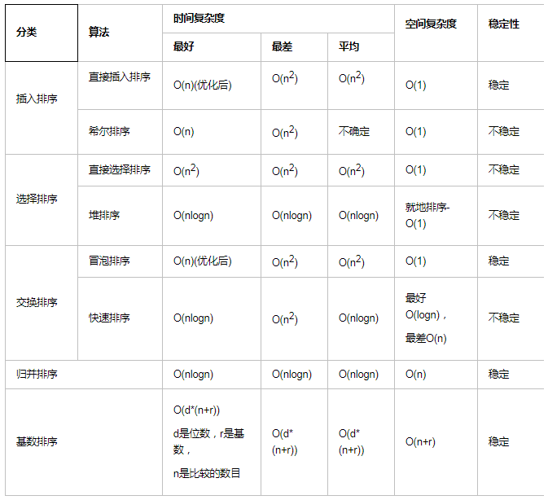
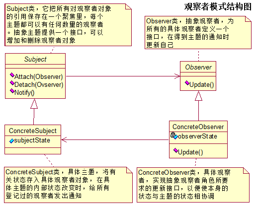

# 一、线程与进程

## 1、线程与进程的区别

1. 进程是资源分配的最小单位，线程是程序执行的最小单位。
2. 进程有自己的独立地址空间，每启动一个进程，系统就会为它分配地址空间，建立数据表来维护代码段、堆栈段和数据段，这种操作非常昂贵。而线程是共享进程中的数据的，使用相同的地址空间，因此CPU切换一个线程的花费远比进程要小很多，同时创建一个线程的开销也比进程要小很多。
3. 线程之间的通信更方便，同一进程下的线程共享全局变量、静态变量等数据，而进程之间的通信需要以IPC【进程间通信方式】进行。不过如何处理好同步与互斥是编写多线程程
4. 序的难点。

## 2、进程间的通信方式

### 1、管道：

- 定义

  **管道**，通常指无名管道，是 UNIX 系统IPC最古老的形式。

- 特点
  - 它是**半双工**的（即数据只能在一个方向上流动），具有固定的读端和写端。
  - 它**只能用于具有亲缘关系的进程之间的通信**（也是父子进程或者兄弟进程之间）。
  - 它可以看成是一种特殊的文件，对于它的读写也可以使用普通的read、write 等函数。但是它不是普通的文件，并不属于其他任何文件系统，并且**只存在于内存中**。

### 2、有名（命名）管道【FIFO】：

- 定义

  **FIFO**，也称为命名/有名管道，它是一种文件类型。

- 特点
  - FIFO也是**半双工**的通信方式。
  - **FIFO可以在无关的进程之间交换数据**（无需亲缘关系），与无名管道不同。
  - FIFO有路径名与之相关联，它以一种特殊设备文件形式**存在于文件系统中**。

### 3、信号量【semaphore】： 

- 定义

  **信号量（semaphore）**与已经介绍过的 IPC 结构不同，它是一个计数器。信号量用于实现进程间的互斥与同步，而不是用于存储进程间通信数据的。

- 特点

  - 信号量用于进程间同步，若要在进程间传递数据需要结合**共享内存**。
  - 信号量基于操作系统的 PV 操作，程序对信号量的操作都是原子操作。
  - 每次对信号量的 PV 操作不仅限于对信号量值加 1 或减 1，而且可以加减任意正整数。
  - 支持信号量组。

### 4、消息队列：

- 定义

  **消息队列**，是消息的链接表，存放在内核中。一个消息队列由一个标识符（即队列ID）来标识。

- 特点

  - 消息队列是**面向记录**的，其中的消息具有特定的格式以及特定的优先级。
  - 消息队列**独立于发送与接收进程**。进程终止时，消息队列及其内容并不会被删除。
  - 消息队列**可以实现消息的随机查询**，消息不一定要以先进先出的次序读取,也可以按消息的类型读取。
  - 消息队列克服了信号传递信息少、管道只能承载无格式字节流以及缓冲区大小受限等缺点。

### 5、共享内存：

- 定义

  **共享内存（Shared Memory）**，指两个或多个进程共享一个给定的存储区。

- 特点

  - 共享内存是最快的一种 IPC【进程间通信】，因为进程是直接对内存进行存取。
  - 因为多个进程可以同时操作，所以**需要进行同步**。
  - **信号量+共享内存**通常结合在一起使用，信号量用来同步对共享内存的访问。

### 6、信号：

​	 信号是一种比较复杂的通信方式，用于通知接收进程某个事件已经发生。

### 7、套接字（Socket）：

​	 套解字也是一种进程间通信机制，与其他通信机制不同的是，它可用于不同机器间的进程通信。

# 二、网络通信协议

## 1、TCP/IP

OSI是一个理论上的七层网络通信模型，而TCP/IP则是实际运行的四层网络协议。

TCP/IP包含：

1. 网络接口层，主机必须使用某种协议与网络相连。
2. 网络层，使主机可以把分组发往任何网络，并使分组独立地传向目标。IP协议。
3. 传输层，使源端和目的端机器上的对等实体可以进行会话。TCP和UDP协议。
4. 应用层，包含所有的高层协议，FTP/TELNET/SMTP/DNS/NNTP/HTTP。

OSI七层协议：

1. 物理层。
2. 数据链路层。
3. 网络层。
4. 传输层。
5. 会话层。
6. 表示层。
7. 应用层。

## 2、TCP

TCP是一种**==面向连接的、可靠的、基于字节流==**的TCP/IP协议中的【传输层】协议。


### 1、建立连接：三次握手

- 三次握手

  1. 建立连接时，客户端发送syn包（syn=j）到服务器，并进入SYN_SEND状态，等待服务器确认；

     SYN：同步序列编号（Synchronize Sequence Numbers）。

  2. 服务器收到syn包，必须确认客户的SYN（ack=j+1），同时自己也发送一个SYN包（syn=k），即SYN+ACK包，此时服务器进入SYN_RECV状态；

  3. 客户端收到服务器的SYN+ACK包，向服务器发送确认包ACK(ack=k+1），此包发送完毕，客户端和服务器进入ESTABLISHED（TCP连接成功）状态，完成三次握手。

  

- 为什么要采用三次握手，两次不行吗？

  ​	**为了避免由于网络延迟导致创建无效连接，造成服务端资源浪费的问题。**比如客户端发出的一个连接请求没有丢失，而是长时间在某个网络节点滞留了，以至于客户端都认为该请求已丢失并将之释放之后，它才到达服务端，而服务端并不清楚该请求的状况，它会认为这个请求是客户端新发出的一个请求，如果不用”三次握手“的话，则服务端在接收到这个请求之后，就会跟客户端建立连接，但实际上这个请求已经被客户端释放掉了，所以客户端不会去处理这一次连接，而服务端又不知道，所以它会一直在等待客户端发送数据过来，如此就造成了服务端的资源浪费。

### 2、关闭连接：四次挥手

- 四次挥手

  1. 当主机A的应用程序通知TCP数据已经发送完毕时，TCP向主机B发送一个带有FIN附加标记的报文段（FIN表示英文finish）。
  2. 主机B收到这个FIN报文段之后，并不立即用FIN报文段回复主机A，而是先向主机A发送一个确认序号ACK，同时通知自己相应的应用程序：对方要求关闭连接（先发送ACK的目的是为了防止在这段时间内，对方重传FIN报文段）。
  3. 主机B的应用程序告诉TCP：我要彻底的关闭连接，TCP向主机A送一个FIN报文段。
  4. 主机A收到这个FIN报文段后，向主机B发送一个ACK表示连接彻底释放。

  

- 为什么连接的时候是三次握手，关闭的时候却是四次握手？

  ​	因为当Server端收到Client端的SYN连接请求报文后，可以直接发送SYN+ACK报文。其中ACK报文是用来应答的，SYN报文是用来同步的。但是关闭连接时，当Server端收到FIN报文时，很可能并不会立即关闭SOCKET，所以只能先回复一个ACK报文，告诉Client端，"你发的FIN报文我收到了"。只有等到我Server端所有的报文都发送完了，我才能发送FIN报文，因此不能一起发送。故需要四步握手。

### 3、滑动窗口协议

​	**滑动窗口协议是传输层进行流控的一种措施，接收方通过告知发送方自己的窗口大小，从而控制发送方的发送速度，以此达到防止发送方发送速度过快而导致自己被淹没的目的。**

​	ACK包含两个非常重要的信息：**一是期望接收到的下一字节的序号n，该n代表接收方已经接收到了前n-1字节数据。二是当前的窗口大小m，如此发送方在接收到ACK包含的这两个数据后就可以计算出还可以发送多少字节的数据给对方，这就是滑动窗口控制流量的基本原理。**

​	TCP的滑动窗口是动态的，应用程序在需要（如内存不足）时，通过API通知TCP协议栈缩小TCP的接收窗口。然后TCP协议栈在下个段发送时包含新的窗口大小通知给对端，对端按通知的窗口来改变发送窗口，以此达到减缓发送速率的目的。

### 4、TCP与UDP区别

- TCP提供面向连接的、可靠的数据流传输，而UDP提供的是非面向连接的、不可靠的数据流传输。

  如：

  - TCP就像打电话，需要双方都接通了，才能进行通话。
  - 而UDP就像发邮件，不管对方存不存在，能不能接收到，我都可以将邮件发过去。

- TCP注重数据安全性，UDP数据传输快，因为不需要连接等待，少了许多操作，但是其安全性却一般。

- TCP对应的协议（FTP/SMTP/HTTP），UDP（DNS）。

## 3、HTTP

HTTP是TCP/IP协议中的【应用层】协议。==它不涉及数据包传输，主要规定了客户端和服务器之间的通信格式，是互联网信息交互中最常用的协议。==

特点：

1. 简单快速。只需要传【请求方法】与【资源路径】就能确定资源。
2. 传输灵活，可传输【任意类型】的数据。
3. 无连接。即每次连接只处理一个请求，处理结束后便主动释放连接。但在HTTP1.1中可以使用keep-alive来复用相同的TCP连接发送多个请求。
4. 无状态。
   1.  协议对于事务处理没有记忆能力，即对同一个url的请求是没有上下文关系的，每次请求都是独立的，请求的执行情况和结果与前面的请求和之后的请求是没有直接关系的，它不会受前面的请求应答情况的直接影响，也不会直接影响后面的请求应答情况。
   2. 无状态还体现在服务器中没有保存客户端的状态，客户端每次请求服务器都需要带上自己的状态。因为无法记录用户的状态，所以才会出现Session与Cookie。

## 4、Session与Cookie

### Cookie

- **Cookie描述**

​	Cookie实际上是一小段的文本信息，用来配合服务器进行用户状态的辨认。

​	客户端请求服务器，如果服务器需要记录该用户状态，就使用response向客户端浏览器颁发一个Cookie。客户端浏览器会把Cookie保存起来。当浏览器再次请求该网站时，浏览器把请求的网址连同该Cookie一同提交给服务器。服务器通过检查该Cookie，以此来辨认用户状态。服务器还可以根据需要修改Cookie的内容。

**注意：**Cookie功能需要浏览器的支持。如果浏览器不支持Cookie（如大部分手机中的浏览器）或者把Cookie禁用了，Cookie功能就会失效。不同的浏览器采用不同的方式保存Cookie。


- **Cookie操作**

​	Java中把Cookie封装成了javax.servlet.http.Cookie类。每个Cookie都是该Cookie类的对象。服务器通过操作Cookie类对象对客户端Cookie进行操作。通过**==request.getCookie()获取客户端提交的所有Cookie==**（以Cookie[]数组形式返回），**==通过response.addCookie(Cookie cookie)向客户端设置Cookie。==**

​	Cookie对象使用key-value键值对的形式保存用户状态，一个Cookie对象保存一个键值对，一个request或者response同时使用多个Cookie。因为Cookie类位于包javax.servlet.http.*下面，所以JSP中不需要import该类。


- **Cookie的不可跨域性**

  ​	很多网站都会使用Cookie。例如，Google会向客户端颁发Cookie，Baidu也会向客户端颁发Cookie。那浏览器访问Google会不会也携带上Baidu颁发的Cookie呢？或者Google能不能修改Baidu颁发的Cookie呢？

  ​	答案是否定的。**Cookie具有不可跨域名性**。根据Cookie规范，浏览器访问Google只会携带Google的Cookie，而不会携带Baidu的Cookie。Google也只能操作Google的Cookie，而不能操作Baidu的Cookie。

  ​	Cookie在客户端是由浏览器来管理的。浏览器能够保证Google只会操作Google的Cookie而不会操作 Baidu的Cookie，从而保证用户的隐私安全。**浏览器判断一个网站是否能操作另一个网站Cookie的依据是域名。**Google与Baidu的域名不一样，因此Google不能操作Baidu的Cookie。

  

- **Cookie编码**

  ​	cookie不仅可以使用ASCII字符与Unicode字符，还可以使用二进制数据。例如在Cookie中使用数字证书，提供安全度。使用二进制数据时也需要进行编码。由于浏览器每次请求服务器都会携带Cookie，因此Cookie内容不宜过多，否则影响速度。

  **注：**中文与英文字符不同，**中文属于Unicode字符，在内存中占4个字符，而英文属于ASCII字符，内存中只占2个字节**。Cookie中使用Unicode字符时需要对Unicode字符进行编码，否则会乱码。

  [java常见编码格式](https://github.com/Zeb-D/my-review/blob/master/java/java%E4%B8%AD%E5%B8%B8%E8%A7%81%E7%BC%96%E7%A0%81%E6%A0%BC%E5%BC%8F%E5%88%86%E6%9E%90.md)

  

- **Cookie属性**

  除了name与value之外，Cookie还具有其他几个常用的属性。每个属性对应一个getter方法与一个setter方法。Cookie类的所有属性：

  | 属 性 名       | 描 述                                                        |
  | -------------- | ------------------------------------------------------------ |
  | String name    | 该Cookie的名称。Cookie一旦创建，名称便不可更改               |
  | Object value   | 该Cookie的值。如果值为Unicode字符，需要为字符编码。如果值为二进制数据，则需要使用BASE64编码 |
  | **int maxAge** | **Cookie失效的时间，单位秒。如果为正数，则该Cookie在maxAge秒之后失效。如果为负数，则该Cookie为临时Cookie，关闭浏览器即失效，浏览器也不会以任何形式保存该Cookie。如果为0，表示删除该Cookie。默认为–1**【临时cookie，不会在本地持久化】 |
  | boolean secure | 该Cookie是否仅被使用安全协议传输。安全协议。安全协议有HTTPS，SSL等，在网络上传输数据之前先将数据加密。默认为false |
  | String path    | 该Cookie的使用路径。如果设置为“/sessionWeb/”，则只有contextPath为“/sessionWeb”的程序可以访问该Cookie。如果设置为“/”，则本域名下contextPath都可以访问该Cookie。注意最后一个字符必须为“/” |
  | String domain  | 可以访问该Cookie的域名。如果设置为“.google.com”，则所有以“google.com”结尾的域名都可以访问该Cookie。注意第一个字符必须为“.” |
  | String comment | 该Cookie的用处说明。浏览器显示Cookie信息的时候显示该说明     |
  | int version    | 该Cookie使用的版本号。0表示遵循Netscape的Cookie规范，1表示遵循W3C的RFC 2109规范 |

  

- **Cookie的有效期**

  ​	Cookie的maxAge决定着Cookie的有效期，单位为秒（Second）。Cookie中通过getMaxAge()方法与setMaxAge(int maxAge)方法来读写maxAge属性。

  ​	**如果maxAge属性为正数，则表示该Cookie会在maxAge秒之后自动失效。浏览器会将maxAge为正数的 Cookie持久化，即写到对应的Cookie文件中。无论客户关闭了浏览器还是电脑，只要还在maxAge秒之前，登录网站时该Cookie仍然有效。** 下面代码中的Cookie信息将永远有效。

  ```
  Cookie cookie = new Cookie("username","helloweenvsfei");   // 新建Cookie
  cookie.setMaxAge(Integer.MAX_VALUE);           // 设置生命周期为MAX_VALUE
  response.addCookie(cookie);                    // 输出到客户端
  ```

  ​	**如果maxAge为负数，则表示该Cookie仅在本浏览器窗口以及本窗口打开的子窗口内有效，关闭窗口后该 Cookie即失效。maxAge为负数的Cookie，为临时性Cookie，不会被持久化，不会被写到Cookie文件中。Cookie信息保存在浏览器内存中，因此关闭浏览器该Cookie就消失了。**==Cookie默认的maxAge值为–1。==

  ​	**如果maxAge为0，则表示删除该Cookie。**Cookie机制没有提供删除Cookie的方法，因此通过设置该Cookie即时失效实现删除Cookie的效果。失效的Cookie会被浏览器从Cookie文件或者内存中删除。

  ​	Cookie并不提供修改、删除操作。如果要修改某个Cookie，只需要新建一个同名的Cookie，添加到response中覆盖原来的Cookie。如果要删除某个Cookie，只需要新建一个同名的Cookie，并将maxAge设置为0，并添加到response中覆盖原来的Cookie。注意是0而不是负数。负数代表其他的意义。

  **注意：**==修改、删除Cookie时，新建的Cookie除value、maxAge之外的所有属性，例如name、path、domain等，都要与原Cookie完全一样。否则，浏览器将视为两个不同的Cookie不予覆盖，导致修改、删除失败。==

  

- **Cookie的域名**

  ​	Cookie是不可跨域名的。域名www.google.com颁发的Cookie不会被提交到域名www.baidu.com去。这是由Cookie的隐私安全机制决定的。隐私安全机制能够禁止网站非法获取其他网站的Cookie。

  ​	如果同一个一级域名下的两个二级域名如www.helloweenvsfei.com和 images.helloweenvsfei.com也交互使用Cookie，想所有 helloweenvsfei.com名下的二级域名都可以使用该Cookie，需要设置Cookie的domain参数：

  ```java
  Cookie cookie = new Cookie("time","20080808"); // 新建Cookie
  cookie.setDomain(".helloweenvsfei.com");           // 设置域名，以helloweenvsfei.com结尾的域名都可以访问此cookie
  cookie.setPath("/");                              // 设置路径
  cookie.setMaxAge(Integer.MAX_VALUE);               // 设置有效期
  response.addCookie(cookie);                       // 输出到客户端
  ```

[**更多Cookie详情，请点这里**](https://github.com/Zeb-D/my-review/blob/master/%E7%BD%91%E7%BB%9C%E5%8D%8F%E8%AE%AE/Cookie%E4%B8%8ESession%E6%B7%B1%E5%85%A5%E7%A0%94%E7%A9%B6.md#%E4%BB%80%E4%B9%88%E6%98%AFcookie)


### Session

- **Session描述**

  ​	Session是另一种记录客户状态的机制，不同的是Cookie保存在客户端浏览器中，而Session保存在服务器上。客户端浏览器访问服务器的时候，服务器把客户端信息以某种形式记录在服务器上。这就是Session。客户端浏览器再次访问时只需要从该Session中查找该客户的状态就可以了。

  ​	如果说**==Cookie机制是通过检查客户身上的“通行证”来确定客户身份的话，那么Session机制就是通过检查服务器上的“客户明细表”来确认客户身份。Session相当于程序在服务器上建立的一份客户档案，客户来访的时候只需要查询客户档案表就可以了。==**

  ​	Session对应的类为javax.servlet.http.HttpSession类。每个来访者对应一个Session对象，所有该客户的状态信息都保存在这个Session对象里。**==Session对象是在客户端第一次请求服务器的时候创建的==**。

  ​	当多个客户端执行程序时，服务器会保存多个客户端的Session。获取Session的时候也不需要声明获取谁的Session。**==Session机制决定了当前客户只会获取到自己的Session，而不会获取到别人的Session。各客户的Session也彼此独立，互不可见的==**。

  提示**：Session的使用比Cookie方便，但是过多的Session存储在服务器内存中，会对服务器造成压力。**

  

- **Session常用方法**

  | 方 法 名                                          | 描 述                                                        |
  | ------------------------------------------------- | ------------------------------------------------------------ |
  | void setAttribute(String attribute, Object value) | 设置Session属性。value参数可以为任何Java Object。通常为Java Bean。value信息不宜过大 |
  | String getAttribute(String attribute)             | 返回Session属性                                              |
  | Enumeration getAttributeNames()                   | 返回Session中存在的属性名                                    |
  | void removeAttribute(String attribute)            | 移除Session属性                                              |
  | String getId()                                    | 返回Session的ID。该ID由服务器自动创建，不会重复              |
  | long getCreationTime()                            | 返回Session的创建日期。返回类型为long，常被转化为Date类型，例如：Date createTime = new Date(session.get CreationTime()) |
  | long getLastAccessedTime()                        | 返回Session的最后活跃时间。返回类型为long                    |
  | int getMaxInactiveInterval()                      | 返回Session的超时时间。单位为秒。超过该时间没有访问，服务器认为该Session失效 |
  | void setMaxInactiveInterval(int second)           | 设置Session的超时时间。单位为秒                              |
  | void putValue(String attribute, Object value)     | 不推荐的方法。已经被setAttribute(String attribute, Object Value)替代 |
  | Object getValue(String attribute)                 | 不被推荐的方法。已经被getAttribute(String attr)替代          |
  | boolean isNew()                                   | 返回该Session是否是新创建的                                  |
  | void invalidate()                                 | 使该Session失效                                              |

  Tomcat中Session的**默认超时时间为20分钟**。可以修改web.xml改变Session的默认超时时间。

  ```xml
  <session-config>
     <session-timeout>60</session-timeout>      <!-- 单位：分钟 -->
  </session-config>
  ```

  

- **Session生命周期**

  ​	Session保存在服务器端。**为了获得更高的存取速度，服务器一般把Session放在内存里。每个用户都会有一个独立的Session。如果Session内容过于复杂，当大量客户访问服务器时可能会导致内存溢出。因此，Session里的信息应该尽量精简。**

  ​	**Session在用户第一次访问服务器的时候自动创建**。需要注意的是只有访问JSP、Servlet等程序时才会创建Session，只访问HTML、IMAGE等静态资源并不会创建Session。如果尚未生成Session，也可以使用request.getSession(true)强制生成Session。

  ​	**Session生成后，只要用户继续访问，服务器就会更新Session的最后访问时间，并维护该Session**。用户每访问服务器一次，无论是否读写Session，服务器都认为该用户的Session**活跃（active）**了一次。

  ​	由于会有越来越多的用户访问服务器，因此Session也会越来越多。**为防止内存溢出，服务器会把长时间内没有活跃的Session从内存删除。这个时间就是Session的超时时间。如果超过了超时时间没访问过服务器，Session就自动失效了。**

  ​	Session的超时时间也可以在web.xml中修改。另外，通过调用Session的invalidate()方法可以使Session失效。

  

- **Session对浏览器的要求**

  ​	虽然Session保存在服务器，对客户端是透明的，但它的正常运行仍然需要客户端浏览器的支持。**这是因为Session 需要使用Cookie作为识别标志。HTTP协议是无状态的，Session不能依据HTTP连接来判断是否为同一客户，因此服务器会向客户端浏览器发送一个名为JSESSIONID的Cookie，它的值为该Session的id（也就是HttpSession.getId()的返回值），Session 依据该Cookie来识别是否为同一用户。**

  ​	**该Cookie是服务器自动生成的，它的maxAge属性一般为–1，表示仅当前浏览器内有效，并且各浏览器窗口间不共享，关闭浏览器就会失效。**因此同一机器的两个浏览器窗口访问服务器时，会生成两个不同的Session。但是由浏览器窗口内的链接、脚本等打开的新窗口（也就是说不是双击桌面浏览器图标等打开的窗口）除外。这类子窗口会共享父窗口的Cookie，因此会共享一个Session。

  **注意：新开的浏览器窗口会生成新的Session，但子窗口除外。子窗口会共用父窗口的Session。例如，在链接上右击，在弹出的快捷菜单中选择“在新窗口中打开”时，子窗口便可以访问父窗口的Session。**

  ​	如果客户端浏览器将Cookie功能禁用，或者不支持Cookie怎么办？例如，绝大多数的手机浏览器都不支持Cookie。Java Web提供了另一种解决方案：==URL地址重写==。

  ​	**URL地址重写的原理：**将该用户Session的id信息重写到URL地址中。服务器能够解析重写后的URL获取Session的id。这样即使客户端不支持Cookie，也可以使用Session来记录用户状态。 当然**也可以把该用户Session的id弄到隐藏表单域中**。

  如果服务器需要**Session中禁止使用Cookie**，如修改Tomcat全局的conf/context.xml

  ```xml
  <!-- The contents of this file will be loaded for eachweb application -->
  <Context cookies="false">
      <!-- ... 中间代码略 -->
  </Context>
  ```

[**更多Session详情，请点这里**](https://github.com/Zeb-D/my-review/blob/master/%E7%BD%91%E7%BB%9C%E5%8D%8F%E8%AE%AE/Cookie%E4%B8%8ESession%E6%B7%B1%E5%85%A5%E7%A0%94%E7%A9%B6.md#session%E6%9C%BA%E5%88%B6)

## 5、HTTPS

HTTPS协议是由SSL+HTTP协议构建的可进行加密传输、身份认证的网络协议，要比http协议安全，可防止数据在传输过程中不被窃取和改变，确保数据的完整性，它大幅增加了中间人攻击的成本。

加密过程：

1. Hello - 握手开始于客户端发送Hello消息。包含服务端为了通过SSL连接到客户端的所有信息，包括客户端支持的各种密码套件和最大SSL版本。服务器也返回一个Hello消息，包含客户端需要的类似信息，包括到底使用哪一个加密算法和SSL版本。
2. 证书交换 - 现在连接建立起来了，服务器必须证明他的身份。这个由SSL证书实现，像护照一样。SSL证书包含各种数据，包含所有者名称，相关属性（域名），证书上的公钥，数字签名和关于证书有效期的信息。客户端检查它是不是被CA验证过的且根据数字签名验证内容是否被修改过。注意服务器被允许需求一个证书去证明客户端的身份，但是这个只发生在敏感应用。
3. 密钥交换 - 先使用RSA非对称公钥加密算法（客户端生成一个对称密钥，然后用SSL证书里带的服务器公钥将改对称密钥加密。随后发送到服务端，服务端用服务器私钥解密，到此，握手阶段完成。）或者DH交换算法（上面有）在客户端与服务端双方确定一将要使用的密钥，这个密钥是双方都同意的一个简单，对称的密钥，这个过程是基于非对称加密方式和服务器的公钥/私钥的。
4. 加密通信 - 在服务器和客户端加密实际信息是用到对称加密算法，用哪个算法在Hello阶段已经确定。对称加密算法用对于加密和解密都很简单的密钥，这个密钥是基于第三步在客户端与服务端已经商议好的。与需要公钥/私钥的非对称加密算法相反。

## 6、Socket

- **Socket**

​	Socket本质是编程接口(API)，对TCP/IP的封装，TCP/IP也要提供可供程序员做网络开发所用的接口，是操作系统对外开放的接口。


- Socket三个核心
  - IP地址
  - 端口号
  - 传输协议（TCP、UDP）

# 三、排序算法

## 1、快速排序


​	首先任意选取一个数据（通常选用数组的第一个数）作为关键数据，然后将所有比它小的数都放到它前面，所有比它大的数都放到它后面，这个过程称为一趟快速排序。

- **时间复杂度**
  - **最好情况**：每次划分过程产生的区间大小都为n/2，一共需要划分log2n次，每次需要比较n-1次，即时间复杂度为==O(nlog2n)==。
  - **最坏情况：**每次划分过程产生的两个区间分别包含n-1个元素和1个元素，一共需要划分n-1次，每次最多交换n-1次，这就是冒泡排序了，时间复杂度为==O(n^2)==。【比如逆序的数组要排成顺序的数组**】**
  - **平均情况**：**O(nlogn)**。
- **空间复杂度**：
  - 最好情况：O(logn)。
  - 最差情况：O(n)。
- **稳定性：**一般情况下，快速排序算法==不稳定==。

```java
public class QuickSort {

	public static void quickSort(int arr[], int start, int end) {
		int i = start;
		int j = end;
		int key = arr[start]; // 基值

		while (i < j) {
			// j --遍历，过滤掉大于基值的数，循环会在遇到小于基值的数时停下来
			while (i < j && arr[j] >= key) {
				j--;
			}

			// 若i >= j ，则不做任何处理,否则就是找到小于基值的数了
			if (i < j) {
				// 交换
				int temp = arr[j];
				arr[j] = arr[i];
				arr[i] = temp;

				// 交换过后i往右移一位
				i++;
			}

			// i++遍历，过滤掉小于基值的数，循环会在遇到大于基值的数时停下来
			while (i < j && arr[i] <= key) {
				i++;
			}

			// 若i >= j ，则不做任何处理,否则就是找到大于基值的数了
			if (i < j) {
				// 交换
				int temp = arr[i];
				arr[i] = arr[j];
				arr[j] = temp;

				// 交换过后 j 往左移一位
				j--;
			}

			// 递归调用，把key前面的完成排序
			if (i > start) {
				quickSort(arr, start, i - 1);
			}
			// 递归调用，把key后面的完成排序
			if (j < end) {
				quickSort(arr, j + 1, end);
			}
		}
	}

	/* 带泛型，且减少交换次数，提高效率 */
	public static <T extends Comparable<? super T>> void quickSortPlus(T[] targetArr, int start, int end) {

		int i = start, j = end;
		T key = targetArr[start]; // 要对比的基值

		while (i < j) {
			/* 按j--方向遍历目标数组，直到比key小的值为止 */
			while (j > i && targetArr[j].compareTo(key) >= 0) {
				j--;
			}
			
			if (i < j) {
				/* targetArr[i]已经保存在key中，可将后面的数填入 */
				targetArr[i] = targetArr[j];

				i++;
			}
			
			/* 按i++方向遍历目标数组，直到比key大的值为止 */
			while (i < j && targetArr[i].compareTo(key) <= 0) {
				/*
				 * 此处一定要小于等于零，假设数组之内有一亿个1，0交替出现的话，而key的值又恰巧是1的话，
				 * 那么这个小于等于的作用就会使下面的if语句少执行一亿次。
				 */
				i++;
			}
			
			if (i < j) {
				/* targetArr[j]已保存在targetArr[i]中，可将前面的值填入 */
				targetArr[j] = targetArr[i];

				j--;
			}
		}
		
		/* j --，i ++ 到最后会有：i==j ，此时的位置就是基值所处的位置*/
		targetArr[i] = key;

		// 递归调用，把key前面的完成排序
		if (i > start) {
			quickSortPlus(targetArr, start, i - 1);
		}
		// 递归调用，把key后面的完成排序
		if (j < end) {
			quickSortPlus(targetArr, j + 1, end);
		}
	}
}
```

## 2、堆排序

​	堆排序是一种树形选择排序方法，它的特点是：在排序的过程中，将array[0，...，n-1]看成是一颗**完全二叉树的顺序存储结构**，利用完全二叉树中双亲节点和孩子结点之间的内在关系，在当前无序区中选择关键字最大（最小）的元素。

1. 若array[0，...，n-1]表示一颗完全二叉树的顺序存储模式，则双亲节点指针和孩子结点指针之间的内在关系如下：

　　任意一节点指针 i：父节点：i==0 ? null : (i-1)/2

　　　　　　　　　　  左孩子：2*i + 1

　　　　　　　　　　  右孩子：2*i + 2

2. 堆的定义：**==n个关键字序列array[0，...，n-1]，当且仅当满足下列要求：(0 <= i <= (n-1)/2)==**

　　　　　　① array[i] <= array[2*i + 1] 且 array[i] <= array[2*i + 2]； 称为小根堆；

　　　　　　② array[i] >= array[2*i + 1] 且 array[i] >= array[2*i + 2]； 称为大根堆；

3. 建立大根堆：

　　n个节点的完全二叉树array[0，...，n-1]，最后一个节点n-1是第(n-1-1)/2个节点的孩子。对第(n-1-1)/2个节点为根的子树调整，使该子树成为堆。

　　对于大根堆，**调整方法**为：若【根节点的关键字】小于【左右子女中关键字较大者】，则交换。

　　之后向前依次对各节点（(n-2)/2 - 1）~ 0为根的子树进行调整，看该节点值是否大于其左右子节点的值，若不是，将左右子节点中较大值与之交换，交换后可能会破坏下一级堆，于是继续采用上述方法构建下一级的堆，直到以该节点为根的子树构成堆为止。

　　反复利用上述调整堆的方法建堆，直到根节点。

4.堆排序：（大根堆）

　　①将存放在array[0，...，n-1]中的n个元素建成初始大根堆；

　　②将堆顶元素与堆底最后一个元素进行交换，则序列的最大值即已放到正确的位置；

　　③但此时堆被破坏，将堆顶元素向下调整使其继续保持大根堆的性质，再重复第②③步，直到堆中仅剩下一个元素为止。


堆排序算法的性能分析：

- 空间复杂度：==o(1)==，就地排序；
- 时间复杂度:
  - 建堆：==o(n)==
  - 每次调整：==o(log n)==。
  - 最好、最坏、平均情况下：==o(n*logn)==;
- 稳定性：==不稳定==

```java
package 排序算法.堆排序;

public class HeapSort {
	// 构建大根堆：将array看成完全二叉树的顺序存储结构
	private int[] buildMaxHeap(int[] array) {
		// 从最后一个节点array.length-1的父节点（array.length-1-1）/2开始，直到根节点0，反复调整堆结构
		for (int i = (array.length - 2) / 2; i >= 0; i--) {
			adjustDownToUp(array, i, array.length);
		}
		return array;
	}

	// 从每一个非叶子节点array[k]开始，自下往上逐步调整树形结构，添加一个length参数是为了方便排序
	private void adjustDownToUp(int[] array, int k, int length) {
		int temp = array[k];//父节点
        
        /**
		 * int i = 2*k+1; 父节点的第一个子节点
		 * 
		 * i=2*i+1：处理完当前父节点时，子节点组成的堆结构有可能会被破坏，需要往下调整
		 */
		for (int i = 2 * k + 1; i < length - 1; i = 2 * i + 1) { // i为初始化为节点k的左孩子，沿节点较大的子节点向下调整
			if (i < length && array[i] < array[i + 1]) { // 取节点较大的子节点的下标
				i++; // 如果节点的右孩子>左孩子，则取右孩子节点的下标
			}
			if (temp >= array[i]) { // 父节点 >= 左右子女中关键字较大者，调整结束
				break;
			} else { // 根节点 < 左右子女中关键字较大者
				array[k] = array[i]; // 将左右子结点中较大值array[i]调整到父节点上
				k = i; // 【关键】修改k值，以便继续向下调整，防止此次调整后，子节点的结构被破坏
			}
		}
		array[k] = temp; // 被调整的结点的值放人最终位置
	}

	// 堆排序
	public int[] heapSort(int[] array) {
		array = buildMaxHeap(array); // 初始建堆，array[0]为第一趟值最大的元素
		for (int i = array.length - 1; i > 1; i--) {
			int temp = array[0]; // 将堆顶元素和堆低元素交换，即得到当前最大元素正确的排序位置
			array[0] = array[i];
			array[i] = temp;
            
            //交换过后堆结构被破坏，整理，将剩余的元素整理成堆，
            //i可以过滤掉已经最后面已经经过交换拍好序了的元素
			adjustDownToUp(array, 0, i); 
		}
		return array;
	}

	// 删除堆顶元素操作
	public int[] deleteMax(int[] array) {
		// 将堆的最后一个元素与堆顶元素交换，堆底元素值设为Integer.MIN_VALUE
		array[0] = array[array.length - 1];
		array[array.length - 1] = Integer.MIN_VALUE;
		// 对此时的根节点进行向下调整
		adjustDownToUp(array, 0, array.length);
		return array;
	}

	// 插入操作:向大根堆array中插入数据data
	public int[] insertData(int[] array, int data) {
		array[array.length - 1] = data; // 将新节点放在堆的末端
		int k = array.length - 1; // 需要调整的节点
		int parent = (k - 1) / 2; // 双亲节点
		while (parent >= 0 && data > array[parent]) {
			array[k] = array[parent]; // 双亲节点下调
			k = parent;
			if (parent != 0) {
				parent = (parent - 1) / 2; // 继续向上比较
			} else { // 根节点已调整完毕，跳出循环
				break;
			}
		}
		array[k] = data; // 将插入的结点放到正确的位置
		return array;
	}

	public void toString(int[] array) {
		for (int i : array) {
			System.out.print(i + " ");
		}
	}

	public static void main(String args[]) {
		HeapSort hs = new HeapSort();
		int[] array = { 87, 45, 78, 32, 17, 65, 53, 9, 122 };
		System.out.print("构建大根堆：");
		hs.toString(hs.buildMaxHeap(array));
		System.out.print("\n" + "删除堆顶元素：");
		hs.toString(hs.deleteMax(array));
		System.out.print("\n" + "插入元素63：");
		hs.toString(hs.insertData(array, 63));
		System.out.print("\n" + "大根堆排序：");
		hs.toString(hs.heapSort(array));
	}
}

```

测试结果：

```java
构建大根堆：122 87 78 45 17 65 53 9 32 
删除堆顶元素：87 45 78 32 17 65 53 9 -2147483648 
插入元素63：87 63 78 45 17 65 53 9 32 
大根堆排序：9 17 32 45 53 63 65 78 87 
```


## 3、TOP K

如何在N个元素中寻找前K大的数？

快速排序：

- 原理：每次快速排序中的划分过程能找到一个全部大于左边元素的一个值。**==如果该值的位置等于K，那么这个值和它左边的所有元素就是前K大的数；如果该值的位置小于K，那么对右边的元素继续划分排序；如果该值的位置大于K，那么对左边的元素继续划分排序。==**
- 问题：但空间复杂度是O(N)，如果你要在很多元素中找很少几个top K的元素，或者在一个巨大的数据流里找到top K，快速排序是不合适的，堆排序更省地方。

```java
/**
	 * 原理：
	 *		根据快排的性质：每一趟快排都将大于基值K的数放在K的右边，小于K的数放在K的左边，由此
	 * 		每次快速排序中的划分过程定能找到一个全部大于左边元素的一个值arr[i]。
	 * 		如果该值的位置等于K（即arr.length-i==k），那么这个值和它左边的所有元素就是前K大的数；
	 * 		如果该值的位置小于K（即arr.length-i>k），那么对右边的元素继续划分排序；
	 * 		如果该值的位置大于K（即arr.length-i<k），那么对左边的元素继续划分排序。
	 * 
	 * 实质：返回的是第 k 大的数所在的下标
	 */
	public static int findTopK_quickSort(int [] array, int start, int end, int k){
		int key = array[start]; //基值
		int left = start;
		int right = end;
		
		while (left < right) {
			
			//先从右往左找 小于 key 的数，跳过 大于等于key 的数
			while (left < right && array[right] >= key) {
				right --;
			}
			
			if (left < right) {
				
				//找到了小于key的数，则将其与key交换位置，放到key的前面
				int tmp = array[right];
				array[right] = array[left];
				array[left] = tmp;
				
				//从左开始找……
				left ++;
			}
			
			//先从左往右找 大于 key 的数，跳过 小于等于key 的数
			while (left < right && array[left] <= key) {
				left ++;
			}
			
			if (left < right) {
				
				//找到了大于key的数，则将其与key交换位置，放到key的后面
				int temp = array[left];
				array[left] = array[right];
				array[right] = temp;
				
				//又从右开始找……
				right --;
			}
		}
		
		/**
		 * 截取最后面的那一段，即都大于key的数
		 */
		int rank = array.length - left;
		
		if (rank == k) {	//表示最后那几个数就是 topK
			return left;
		}else if (rank < k) {	//表示分割点在 key 的右边，往左找
			return findTopK_quickSort(array, start, left -1, k);
		}else {
			//表示分割点在 key 的左边，往右找
			return findTopK_quickSort(array, right + 1, end, k);
		}
	}
```

堆排序：

- 原理：**==申请一个容量为K的数组，存入数组的前K个元素，创建长度为K的最小堆；从K开始循环数组的剩余元素（n-k个），如果元素(a)比最小堆的根节点大，将a设置成最小堆的根节点，然后重建最小堆；循环完成后，最小堆中的所有元素就是需要找的最大的K个元素。==**
- 优点：可以在N个元素中找到top K，时间复杂度是O(N log K)，空间复杂的是O(K)。

```java
/**
	 * 原理：
	 * 申请一个容量为K的数组，存入数组的前K个元素，创建长度为K的最小堆；
	 * 从K开始循环数组的剩余元素（n-k个），如果元素(a)比最小堆的根节点大，
	 * 将a设置成最小堆的根节点，然后重建最小堆；循环完成后，
	 * 最小堆中的所有元素就是需要找的最大的K个元素。
	 * 
	 * 直接将最小堆返回
	 */
	public static int [] findTopK_heapSort(int [] array, int k) {
		//申请一个容量为K的数组，存入数组的前K个元素；
		int [] arr = new int [k];
		for (int i = 0; i < k; i++) {
			arr[i] = array[i];
		}
		
		//创建长度为K的最小堆
		arr = buidMinHeap(arr);
		
		/**
		 * 从K开始循环数组的剩余元素（n-k个），如果元素(a)比最小堆的根节点大，
		 * 将a设置成最小堆的根节点，然后重建最小堆；
		 */
		for (int i = k; i < array.length; i++) {
			if (array[i] > arr[0]) {
				arr[0] = array[i];
				//重新构建最小堆
				buidMinHeap(arr);
			}
		}
		return arr;
	}
	
	/**
	 * 构建最小堆
	 * @param array：将array看成完全二叉树的顺序存储结构
	 * @return
	 */
	private static int []  buidMinHeap(int[] array) {
		
		//从最后一个非叶子节点开始到根节点，处理每一个父节点
		for (int i = (array.length - 1 - 1) / 2; i >= 0; i--) {
			//调整堆的结构
			adjustDownToUp_min(array, i, array.length);
		}
		return array;
	}
	
	/**
	 * 从下到上，调整堆结构-小根堆
	 * 
	 * @param array：将array看成完全二叉树的顺序存储结构
	 * @param faterIndex：当前需要调整结构的父节点
	 * @param length：当前需要调整结构的数组长度
	 */
	private static void adjustDownToUp_min(int[] array, int faterIndex, int length) {
		int fatherValue = array[faterIndex];	//记录当前父节点的值
		
		/**
		 * int i = 2*faterIndex+1; 父节点的第一个子节点
		 * 
		 * i=2*i+1：处理完当前父节点时，子节点组成的堆结构有可能会被破坏，需要往下调整
		 */
		for (int i = 2*faterIndex+1; i < length - 1; i=2*i+1) {
			
			//找到当前父节点的最小子节点的下标
			if (i < length - 1 && array[i] > array[i + 1]) {
				i ++;
			}
			
			//若当前父节点是最小的，则跳出循环
			if (array[faterIndex] <= array[i]) {
				break;
			}else {
				
				//否则将最小的子节点与父节点交换
				array[faterIndex] = array[i];
				
				// 【关键】修改父节点下标，以便继续向下调整，防止此次调整后，子节点的堆结构被破坏
				faterIndex = i; 
			}
		}
		
		//将父节点的值放入调整后的父节点
		array[faterIndex] = fatherValue;
	}
```

测试：

```java
public static void main(String[] args) {
		int[] array = { 87, 45, 78, 32, 17, 65, 53, 9, 122 };
		
		System.out.print("通过快速排序： ");
		int k = findTopK_quickSort(array, 0, array.length -1, 5);
		for (int i = array.length -1 - k ; i < array.length; i ++) {
			if (i != array.length - 1) {
				System.out.print(array[i] + " ");
			}else {
				System.out.println(array[i]);
			}
		}
		
		System.out.print("通过堆排序： ");
		int[] topk = findTopK_heapSort(array, 5);
		for (int i = 0; i < topk.length; i++) {
			if (i != topk.length - 1) {
				System.out.print(topk[i] + " ");
			}else {
				System.out.println(topk[i]);
			}
		}
	}
```

结果输出【此输出只是得到前K个大的数，并没有进行排序】：

```java
通过快速排序： 53 65 78 87 122
通过堆排序： 53 122 78 65 87

```

## 4、常见排序算法的稳定性

- 算法的稳定性

  - 是什么？

     	假定在待排序的记录序列中，存在多个具有相同的关键字的记录，若经过排序，这些记录的相对次序保持不变，即在原序列中，A1=A2，且A1在A2之前，而在排序后的序列中A1仍在A2之前，则称这种排序算法是稳定的；否则称为不稳定的。

  - 有什么用？

    对一个具有多个数字属性的复杂对象进行排序，且其原本的初始顺序存在意义，需要在二次排序的基础上保持原有排序的意义。

    如：要排序的内容是一组原本按照价格高低排序的对象，如今**需要在按价格高低的基础上，再按照销量高低排序**，此时使用稳定性算法，可以使得想同销量的对象依旧保持着价格高低的排序展现，只有销量不同的才会重新排序。

  - [稳定排序及其意义](https://blog.csdn.net/serena_0916/article/details/53893070)

- 不稳定排序算法：
  - [堆排序](https://baike.baidu.com/item/%E5%A0%86%E6%8E%92%E5%BA%8F)
  - [快速排序](https://baike.baidu.com/item/%E5%BF%AB%E9%80%9F%E6%8E%92%E5%BA%8F)
  - [希尔排序](https://baike.baidu.com/item/%E5%B8%8C%E5%B0%94%E6%8E%92%E5%BA%8F)
  - [直接选择排序](https://baike.baidu.com/item/%E7%9B%B4%E6%8E%A5%E9%80%89%E6%8B%A9%E6%8E%92%E5%BA%8F)
- 稳定排序算法：
  - [基数排序](https://baike.baidu.com/item/%E5%9F%BA%E6%95%B0%E6%8E%92%E5%BA%8F)
  - [冒泡排序](https://baike.baidu.com/item/%E5%86%92%E6%B3%A1%E6%8E%92%E5%BA%8F)
  - [直接插入排序](https://baike.baidu.com/item/%E7%9B%B4%E6%8E%A5%E6%8F%92%E5%85%A5%E6%8E%92%E5%BA%8F)
  - [折半插入排序](https://baike.baidu.com/item/%E6%8A%98%E5%8D%8A%E6%8F%92%E5%85%A5%E6%8E%92%E5%BA%8F)
  - [归并排序](https://baike.baidu.com/item/%E5%BD%92%E5%B9%B6%E6%8E%92%E5%BA%8F)



# 四、常用设计模式

## 1、单列模式

1. 懒汉（线程不安全，懒加载）：如果没有实例就创建并返回，会有线程安全问题，简单加synchronized解决，但效率不高，升级版本是DCL。

   ```java
   public class Singleton {
       private static Singleton instance;
       private Singleton (){}
   
       public static Singleton getInstance() {
        if (instance == null) {
            instance = new Singleton();
        }
        return instance;
       }
   }
   ```

   

2. 懒汉的升级DCL【双重检索】（线程安全，懒加载）：加两个if是因为可能会有多个线程一起进入同步块外的if，如果在同步块内不进行二次检验的话就可能会生成多个实例；`instance = new Singleton()`这句会有重排序的问题，用`volidate`解决。

   ```java
   public static Singleton getSingleton() {
       if (instance == null) {                         //Single Checked
           synchronized (Singleton.class) {
               if (instance == null) {                 //Double Checked
                   instance = new Singleton();		//有JVM重排序问题
               }
           }
       }
       return instance ;
   }
   
   //防止JVM指令重排序
   public class Singleton {
       private volatile static Singleton instance; //声明成 volatile，禁用JVM指令重排序
       private Singleton (){}
   
       public static Singleton getSingleton() {
           if (instance == null) {                         
               synchronized (Singleton.class) {
                   if (instance == null) {       
                       instance = new Singleton();
                   }
               }
           }
           return instance;
       } 
   }
   ```

   

3. 饿汉（线程安全，非懒加载）：利用类加载器保证线程安全，但不是懒加载。

   ```java
   public class Singleton{
       //类加载时就初始化，无法从外部文件设置属性，如从properties文件设置属性
       private static final Singleton instance = new Singleton();
       
       private Singleton(){}
   
       public static Singleton getInstance(){
           return instance;
       }
   }
   ```

   

4. 饿汉升级->静态内部类（线程安全，懒加载）：在饿汉的基础上使用静态内部类解决非懒加载问题。

   ```java
   public class Singleton {  
       private static class SingletonHolder {  
           private static final Singleton INSTANCE = new Singleton();  
       }  
       private Singleton (){}  
       public static final Singleton getInstance() {  
           return SingletonHolder.INSTANCE; 
       }  
   }
   ```

   

5. 枚举（线程安全，非懒加载）：写法最简单，可以防止反序列化，但不是懒加载。

   ```java
   public enum EasySingleton{
       INSTANCE;
   }
   ```

   

**总结：**一般情况下直接使用饿汉式就好了，如果明确要求要懒加载会倾向于使用静态内部类，如果涉及到反序列化创建对象时会试着使用枚举的方式来实现单例。

[**单例模式详解，请点击**](http://wuchong.me/blog/2014/08/28/how-to-correctly-write-singleton-pattern)

## 2、装饰器模式

​	在保持原有功能接口不变的基础上动态扩展功能的模式。
​	Java IO包中就使用了该模式，InputStream有太多的实现类如FileInputStream，如果要在每个实现类上加上几种功能如缓冲区读写功能Buffered，则会导致出现FileInputStreamBuffered, StringInputStreamBuffered等等，如果还要加个按行读写的功能，类会更多，代码重复度也太高，你说改原来的接口也行啊，但是这样就是改变接口的内容了，现在我想做到不更改以前的功能，动态地增强原有接口。
所以使用FilterInputStream这个抽象装饰器来装饰InputStream，使得我们可以用BufferedInputStream来包装FileInputStream得到特定增强版InputStream，且增加装饰器种类也会更加灵活。

**缺点：**会引入很多小类，从而增加使用复杂度，多层装饰的时候很容易导致不知道如何使用


## 3、策略模式

​	一个类的行为或其算法可以在运行时更改。这种类型的设计模式属于行为型模式。在策略模式中，我们创建表示各种策略的对象和一个行为随着策略对象改变而改变的 context 对象。策略对象改变 context 对象的执行算法。

比如利用策略模式优化过多 if else 代码，将这些if else算法封装成一个一个的类，任意地替换：

[策略模式优化if-else](https://juejin.im/post/5c5172d15188256a2334a15d)


整体思路如下：

1. 定义一个 InnerCommand 接口，其中有一个 process 函数交给具体的业务实现。
2. 根据自己的业务，会有多个类实现 InnerCommand 接口；这些实现类都会注册到 Spring Bean 容器中供之后使用。
3. 通过客户端输入命令，从 Spring Bean 容器中获取一个 InnerCommand 实例。
4. 执行最终的 process 函数。

缺点：

1. 策略类会增多
2. 所有策略类都需要对外暴露。

## 4、观察者模式

​	当对象间存在一对多关系时，则使用观察者模式（Observer Pattern）。比如，当一个对象被修改时，则会自动通知它的依赖对象。定义对象间的一种一对多的依赖关系，当一个对象的状态发生改变时，所有依赖于它的对象都得到通知并被自动更新。**其实就是发布订阅模式，发布者发布信息，订阅者获取信息，订阅了就能收到信息，没订阅就收不到信息。**



可以看到，该模式有四个角色：

- **抽象被观察者角色**：也就是一个抽象主题，它把所有对观察者对象的引用保存在一个集合中，每个主题都可以有任意数量的观察者。抽象主题提供一个接口，可以增加和删除观察者角色。一般用一个抽象类和接口来实现。
- **抽象观察者角色**：为所有的具体观察者定义一个接口，在得到主题通知时更新自己。
- **具体被观察者角色**：也就是一个具体的主题，在集体主题的内部状态改变时，向所有登记过的观察者发出通知。
- **具体观察者角色**：实现抽象观察者角色所需要的更新接口，以便使本身的状态与制图的状态相协调。

优点：

​	**松偶合、易维护。改变主题或观察者中的一方，另一方不会受到影像。**

缺点：

1. 如果一个被观察者对象有很多的直接和间接的观察者的话，将所有的观察者都通知到会花费很多时间。
2. **如果在观察者和观察目标之间有循环依赖的话，观察目标会触发它们之间进行循环调用，可能导致系统崩溃**。
3. 观察者模式没有相应的机制让观察者知道所观察的目标对象是怎么发生变化的，而仅仅只是知道观察目标发生了变化。

# 五、从RUL到看到网页的整个过程

​	[内容很长，详细请看这里](http://www.wangtianyi.top/blog/2017/10/22/cong-urlkai-shi-,ding-wei-shi-jie/?utm_source=github&utm_medium=github)