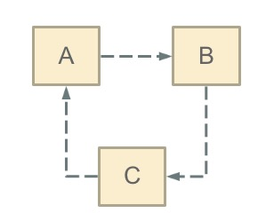
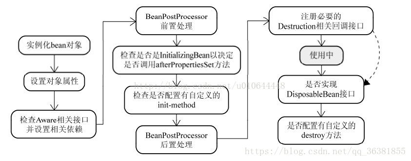

# 一、什么是Spring？

​	Spring是个包含一系列功能的合集，如快速开发的Spring Boot，支持微服务的Spring Cloud，支持认证与鉴权的Spring Security，Web框架Spring MVC。Spring的核心是IOC与AOP。

# 二、Spring MVC处理流程

1. 客户端发送请求。
2. DispatcherServlet拦截器拦截请求，并将请求交给HandlerMapping。
3. HandlerMapping依次调用配置的拦截器，然后找到配置好的业务代码Handler，并执行业务方法。
4. 最后将结果与视图包装成ModelAndView返回给ViewResolver解析器渲染页面。

# 三、如何解决Spring的循环依赖?

## 1、什么是循环依赖？

​	循环依赖-->循环引用。--->即2个或以上bean 互相持有对方，最终形成闭环。

​	如：A依赖B，B依赖C，C又依赖A。【注意：这里不是函数的循环调用【是个死循环，除非有终结条件】，是对象相互依赖关系】

## 2、循环依赖的场景

1. 构造器注入的循环依赖。【**==这个Spring解决不了==**】

   ​	StudentA有参构造是StudentB。StudentB的有参构造是StudentC，StudentC的有参构造是StudentA ，这样就产生了一个循环依赖的情况，所以**在使用构造器注入实例化bean时，若是存在构造器的循环依赖，则IOC容器在实例化该bean时会报错。**

   报错原因：

   ​	**构造器注入方式**在 bean 刚被实例化时【使用有参构造】，就要注入相关的依赖，如：在实例化StudentA时，因StudentA依赖StudentB，所以IOC容器会先去实例化StudentB，而StudentB又依赖StudentC，所以IOC容器又会先去实例化StudentC，而因StudentC依赖StudentA，IOC容器一检查，发现StudentA还没构造完成……如此就形成了一个相互依赖的死循环……。

2. setter注入的循环依赖【==可以解决==】

   ​	field属性的循环依赖【setter方式 单例，默认方式-->通过递归方法找出当前Bean所依赖的Bean，然后提前缓存【会放入Cach中】起来。通过提前暴露 -->暴露一个exposedObject用于返回提前暴露的Bean。】

   **setter方式注入流程：**

   

   图中前两步骤得知：**==Spring是先将Bean对象实例化【依赖无参构造函数】--->再设置对象属性的，==**所以即便有循环依赖，也不会出现问题（报错）；

   不报错的原因：

   ​	Spring先用构造器实例化Bean对象，然后将实例化结束的对象放到一个Map中，并且Spring提供获取这个未设置属性的实例化对象的引用方法。结合我们的实例来看，当Spring实例化了StudentA、StudentB、StudentC后，紧接着会去设置对象的属性，此时StudentA依赖StudentB，就会去Map中取出存在里面的单例StudentB对象，以此类推，就不会出来死循环的问题。

## 3、如何解决循环依赖？

   **使用无参构造器，通过==属性（字段）注入==即可。**

# 四、Spring bean 的生命周期。

1. IOC容器实例化 Bean 对象。

2. 对 bean 对象进行属性赋值（包括依赖注入）。

3. 检查Aware相关接口的实现，若有实现则给Bean注入Aware接口的相关依赖。

   Aware接口是Spring对外暴露底层组件的一种方式，实现了XXXAware接口就可以将XXX组件注入到实现类中来。如A实现了ApplicationContextAware，则Spring会将ApplicationContext【IOC容器】注入进A中，如此就可以在A里面使用ApplicationContext了。

4. BeanPostProcessor前置处理【postProcessBeforeInitialization】，在此可在bean初始化之前对bean进行相关处理。

5. 检查是否实现 InitializingBean接口，若实现则调用 afterPropertiesSet() 方法。

6. 检查是否配置有自定义的 init-method【初始化】方法，有就执行。

7. BeanPostProcessor后置处理【postProcessAfterInitialization】，在此可在bean初始化之后对bean进行相关处理。

8. 注册必要的 Destruction【销毁】相关回调接口。

9. 用户对bean的相关使用...

10. 检查是否实现DisposableBean【销毁前处理】接口，若实现则调用它的destroy方法。

11. 检查是否配置有自定义的 destroy【销毁】 方法，有则执行。

# 五、Spring Bean 的作用域

- singleton：单例模式，Spring IoC容器中只会存在一个共享的Bean实例，无论有多少个Bean引用它，始终指向同一对象。默认IOC容器一启动就会实例化单例bean，可以指定单例bean为懒加载模式，在第一次使用到时才会实例化。
- prototype：原型模式，每次通过Spring容器获取prototype定义的bean时，容器都将创建一个新的Bean实例，每个Bean实例都有自己的属性和状态。prototype bean只有在被使用时才会实例化。
- request：在一次Http请求中，容器会返回该Bean的同一实例。而对不同的Http请求则会产生新的Bean实例，且该bean仅在当前Http Request内有效。
- session：在一次Http Session中，容器会返回该Bean的同一实例。而对不同的Session请求则会创建新的实例，该bean实例仅在当前Session内有效。
- global Session：在一个全局的Http Session中，容器会返回该Bean的同一个实例，仅在使用portlet context时有效。

# 六、Spring 核心

## 1、IOC(DI)

​	IOC【控制反转】：即**将bean的控制权从程序员手里交到Spring IOC 容器中。**以往程序员使用到一个bean时，都需要自己手动去new出来，bean的生命周期都由自己去手动管理，如创建、赋值和销毁等，使用spring后，这些操作大部分都由Sring IOC 容器去自动完成，如bean的创建、属性赋值、依赖注入等，程序员只需要定义好 bean 的成员变量和getter/setter方法就行。

​	DI【依赖注入】：在程序运行期间，若一个 bean 的成员变量引用到了另一个 bean，则 Spring IOC 容器会自动去实例化那个被引用的 bean，并将其注入到这个成员变量中以供使用。

## 2、AOP

1. AOP概念

   AOP：即面向切面编程技术，是OOP【面向对象编程】的补充和完善。

2. AOP由来

   ​	传统的OOP【面向对象】编程的执行流程是从上到下的，没有从左到右，所以在实际生产过程中难免会产生大量与业务无关的重复代码，如许多方法都需要进行日志记录、权限效验等，而AOP的出现就是将这些与业务无关的重复代码抽取出来，组成一个个切面，然后再插入到业务代码的指定位置中，以降低代码的耦合。AOP常用的场景有：权限控制、日志记录、事物处理等。

3. AOP实现

   - 动态代理：对执行消息进行截取与装饰，以取代原有对象行为的执行。
   - 静态织入：引入特定的语法创建“方面”，从而使得编译器可以在编译期间织入有关“方面”的代码。

4. Spring AOP实现

   ​	Spring AOP采用的是**==动态代理==**模式，具体实现有：

   1. jdk 反射机制：

      - 原理：通过反射机制生成代理类的字节码文件，在调用具体方法前调用InvokeHandler来处理。
      - 条件：被代理类需要有接口。

   2. cglib字节码技术：

      - 原理：利用asm开源包，将代理对象类的class文件加载进来，通过修改其字节码生成子类来处理。

      - 条件：通过继承来实现，被代理类不能为 final。

   3. Spring AOP的选择：

      1. 若目标对象实现了接口，默认会采用JDK的动态代理实现AOP，也可以强制使用CGLIB实现。
      2. 若目标对象没有实现接口，则必须采用CGLIB库。【对象类不能被 final 修饰，因为CGLIB是通过继承来实现动态代理的。】
      3. spring会自动在JDK动态代理和CGLIB之间转换。

# 七、Spring与SpringBOOT的区别

​      `Spring Boot`是`Spring`框架的扩展，它免去了开发`Spring`应用程序所需的各种`XML配置`，SpringBoot会自动配置，并支持嵌入式的Servlet容器，使开发Spring应用变得更快，更高效。

###### 以下是`Spring Boot`中的一些特点：

 1：创建独立的`spring`应用。
  2：嵌入`Tomcat`, `Jetty` `Undertow` 而且不需要部署他们。
  3：提供的“starters” poms来简化`Maven`配置
  4：尽可能自动配置`spring`应用。
  5：提供生产指标,健壮检查和外部化配置
  6：绝对没有代码生成和`XML`配置要求

# 八、SpringBoot自动配置原理

1. SpringBoot启动的时候先加载主配置类【标有@SpringBootConfiguration的类】，依靠==@EnableAutoConfiguration==开启自动配置功能 。
2. 自动配置功能开启后，SpringBoot会**==将类路径下  META-INF/spring.factories 里面配置的所有EnableAutoConfiguration的值加入到IOC容器中，这些值其实就是一个个自动配置类；==**
3. 接着SpringBoot为每一个自动配置类进行自动配置功能；
4. 根据==@Conditional==的派生注解判断当前配置类是否生效，若可以生效，则这个配置类就会给容器中添加各种组件；
5. 这些组件的属性是从对应的**==xxxProperties类==**中获取的，而这些类里面的每一个属性又是根据**==@ConfigurationProperties==**注解和对应的配置文件进行绑定的；